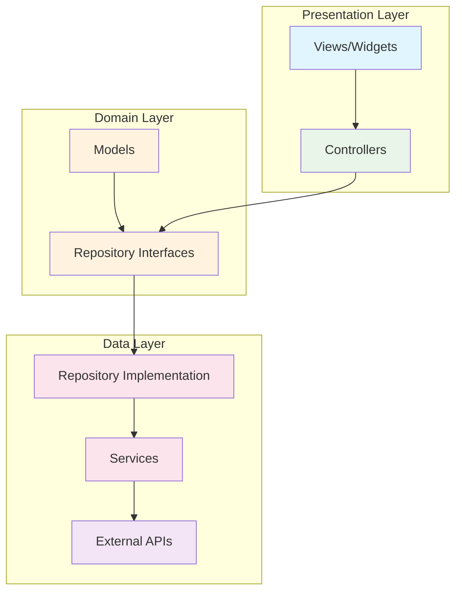

# 🌤️ Flutter Weather App - Enterprise-Grade Architecture

<div align="center">

[](https://flutter.dev/)
[](https://en.wikipedia.org/wiki/SOLID)
[](https://blog.cleancoder.com/uncle-bob/2012/08/13/the-clean-architecture.html)
[](https://opensource.org/licenses/MIT)

Modern, scalable, and maintainable weather forecasting application built with **SOLID principles** and **Clean Architecture** patterns.

[🏗️ Architecture](#-architecture) •
[🚀 Features](#-features) •
[⚙️ Installation](#️-installation) •
[📱 Usage](#-usage) •
[🧪 Testing](#-testing)

</div>

---

## 🏗️ Architecture

This project demonstrates **enterprise-level** Flutter development practices following **SOLID principles** and **Clean Architecture** patterns.

### 📐 SOLID Principles Implementation

#### ✅ **S**ingle Responsibility Principle
```dart
// Each service has a single, well-defined responsibility
class HttpService implements IHttpService          // HTTP operations only
class WeatherService implements IWeatherService    // Weather API operations only  
class LocationService implements ILocationService  // Location operations only
class DialogService implements IDialogService      // Dialog management only
```

#### ✅ **O**pen/Closed Principle
```dart
// Open for extension, closed for modification
abstract class IWeatherService {
  Future<WeatherModel> getCurrentWeather(String city);
  // Easy to extend with new weather providers
}
```

#### ✅ **L**iskov Substitution Principle
```dart
// Any implementation can replace the interface seamlessly
IWeatherService weatherService = WeatherService(); // ✅
IWeatherService mockService = MockWeatherService(); // ✅
```

#### ✅ **I**nterface Segregation Principle
```dart
// Small, focused interfaces instead of large monolithic ones
abstract class IHttpService { /* HTTP operations */ }
abstract class ILocationService { /* Location operations */ }
abstract class IDialogService { /* Dialog operations */ }
```

#### ✅ **D**ependency Inversion Principle
```dart
// High-level modules depend on abstractions, not concretions
class WeatherRepository {
  final IWeatherService _weatherService; // ← Interface, not concrete class
  WeatherRepository({required IWeatherService weatherService});
}
```

### 🏛️ Clean Architecture Layers



### 📁 Project Structure

```
lib/
├── app/
│   ├── bindings/                    # 🔗 Dependency Injection
│   │   └── initial_binding.dart     # IoC Container setup
│   ├── core/                        # 🏛️ Core Infrastructure
│   │   ├── constants/
│   │   │   ├── api_endpoints.dart   # API URLs centralized
│   │   │   ├── api_constants.dart   # Image URLs & constants
│   │   │   └── app_constants.dart   # App-wide constants
│   │   └── theme/
│   │       └── app_theme.dart       # UI theming
│   ├── data/                        # 📊 Data Layer
│   │   ├── models/                  # Data models
│   │   ├── repositories/            # Repository implementations
│   │   │   ├── weather_repository.dart
│   │   │   └── weather_repository_interface.dart
│   │   └── services/                # External service abstractions
│   │       ├── http_service.dart    # HTTP abstraction
│   │       ├── weather_service.dart # Weather API service
│   │       └── location_service.dart# Location service
│   ├── modules/                     # 🎯 Feature Modules
│   │   └── weather/
│   │       ├── controllers/         # Business logic
│   │       └── views/               # UI components
│   └── widgets/                     # 🧩 Reusable UI components
└── main.dart                        # 🚀 Application entry point
```

---

## 🚀 Features

### 🌟 Core Features
- **📍 GPS Location Detection** with intelligent permission handling
- **🌡️ Real-time Weather Data** from OpenWeather API
- **📅 Weather Forecasts**
  - 8-hour hourly forecast
  - 5-day daily forecast
- **🌡️ Temperature Units** (Celsius/Fahrenheit toggle)
- **🎨 Dynamic Backgrounds** based on weather conditions
- **🔄 Pull-to-refresh** functionality
- **📱 Responsive Design** (Phone & Tablet optimized)

### 🏗️ Technical Features
- **🔄 Reactive State Management** with GetX
- **🔌 Dependency Injection** with interface-based DI
- **🌐 Network Abstraction** with proper error handling
- **📱 Platform Permissions** with user-friendly dialogs
- **⚡ Performance Optimized** with lazy loading
- **🎯 Memory Efficient** with proper resource management

---

## ⚙️ Installation

### 📋 Prerequisites
- Flutter SDK 3.6.0+
- Dart SDK 3.0.0+
- Android Studio / VS Code
- OpenWeather API Key

### 🛠️ Setup

1. **Clone the repository**
   ```bash
   git clone https://github.com/your-repo/flutter_weather_app.git
   cd flutter_weather_app/weather_app
   ```

2. **Install dependencies**
   ```bash
   flutter pub get
   ```

3. **Configure API Key**
   
   Create `.env` file in the root directory:
   ```env
   OPENWEATHER_API_KEY=your_api_key_here
   ```
   
   Get your free API key from [OpenWeather](https://openweathermap.org/api)

4. **Run the application**
   ```bash
   flutter run
   ```

---

## 📱 Usage

### 🎯 Core Functionality

1. **Location-based Weather**
   - Grant location permission when prompted
   - App automatically detects your location
   - Displays current weather for your area

2. **Search Cities**
   - Tap search icon in app bar
   - Enter city name or select from quick list
   - View weather for any city worldwide

3. **Temperature Units**
   - Tap thermometer icon to toggle
   - Switch between Celsius and Fahrenheit
   - Preference remembered across sessions

4. **Refresh Data**
   - Pull down on main screen to refresh
   - Tap refresh icon in app bar
   - Automatic updates based on location changes

---

## 🧪 Testing

### 🔬 Architecture Benefits for Testing

Our clean architecture makes the app **highly testable**:

```dart
// Easy to mock services for testing
class MockWeatherService implements IWeatherService {
  @override
  Future<WeatherModel> getCurrentWeather(String city) async {
    return WeatherModel.mock(); // Test data
  }
}

// Easy to test business logic in isolation
class WeatherControllerTest {
  late WeatherController controller;
  late MockWeatherService mockService;
  
  setUp() {
    mockService = MockWeatherService();
    // Inject mock dependency
    controller = WeatherController(weatherService: mockService);
  }
}
```

### 🧪 Running Tests
```bash
# Run all tests
flutter test

# Run with coverage
flutter test --coverage

# Run specific test file
flutter test test/controllers/weather_controller_test.dart
```

---

## 🏗️ Design Patterns Used

### 🎯 **Repository Pattern**
```dart
abstract class IWeatherRepository {
  Future<WeatherModel> getCurrentWeather(String city);
}

class WeatherRepository implements IWeatherRepository {
  final IWeatherService _weatherService;
  WeatherRepository({required IWeatherService weatherService});
}
```

### 🏭 **Service Layer Pattern**
```dart
abstract class IWeatherService {
  Future<WeatherModel> getCurrentWeather(String city);
}

class WeatherService implements IWeatherService {
  final IHttpService _httpService;
  WeatherService({required IHttpService httpService});
}
```

### 💉 **Dependency Injection Pattern**
```dart
class InitialBinding implements Bindings {
  @override
  void dependencies() {
    // Register interfaces with implementations
    Get.lazyPut<IHttpService>(() => HttpService());
    Get.lazyPut<IWeatherService>(() => WeatherService(
      httpService: Get.find<IHttpService>()
    ));
  }
}
```

---

## 📚 Key Learning Points

This project demonstrates:

- ✅ **SOLID Principles** in real Flutter applications
- ✅ **Clean Architecture** implementation
- ✅ **Interface-based design** for testability
- ✅ **Dependency Injection** with GetX
- ✅ **Error handling** and user experience
- ✅ **Code organization** and maintainability
- ✅ **Performance optimization** techniques

---

## 🤝 Contributing

We welcome contributions! Please:

1. Fork the repository
2. Create a feature branch (`git checkout -b feature/amazing-feature`)
3. Follow SOLID principles and clean architecture patterns
4. Write tests for new functionality
5. Commit changes (`git commit -m 'Add amazing feature'`)
6. Push to branch (`git push origin feature/amazing-feature`)
7. Open a Pull Request

### 📝 Code Standards
- Follow Flutter/Dart style guide
- Maintain SOLID principles
- Write interface-first code
- Include comprehensive tests
- Document complex business logic

---

## 📄 License

This project is licensed under the MIT License - see the [LICENSE](LICENSE) file for details.

---

## 🙏 Acknowledgments

- **OpenWeather API** for weather data
- **Unsplash** for beautiful weather images
- **Flutter Team** for the amazing framework
- **GetX Team** for state management
- **Clean Architecture Community** for architectural guidance

---

<div align="center">

**Built with ❤️ using Flutter and Clean Architecture**

⭐ **Star this repo** if you found it helpful!

</div>
