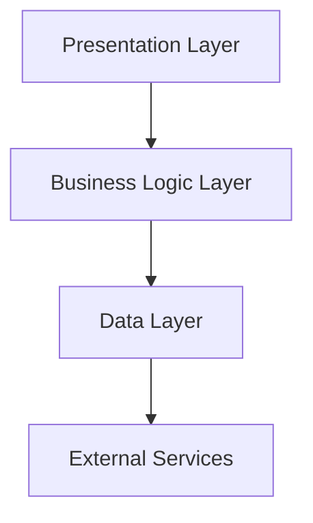

# WeatherScope - Advanced Weather Forecasting Application

<div align="center">

[](https://flutter.dev/)
[](https://opensource.org/licenses/MIT)
[](http://makeapullrequest.com)

A sophisticated Flutter-based weather forecasting application delivering precise meteorological data through an elegant, intuitive interface.

[Key Features](#key-features) •
[Architecture](#architecture) •
[Installation](#installation) •
[Documentation](#documentation) •
[Contributing](#contributing)


</div>

## Key Features

### Core Functionality
- **Location-Based Services**
  - High-precision geolocation
  - Automated location-based updates
  - Intelligent location caching
  - Background location monitoring

- **Comprehensive Weather Data**
  - Real-time meteorological metrics
    - Temperature and thermal sensation
    - Atmospheric pressure
    - Humidity percentage
    - Wind velocity and direction
    - Visibility range
    - UV radiation index
  - Advanced forecasting
    - 24-hour hourly predictions
    - 7-day detailed forecast
    - Precipitation probability
    - Severe weather alerts

- **User Interface**
  - Context-aware dynamic theming
  - Atmospheric condition visualization
  - Day/night cycle adaptation
  - Seamless animations
  - Cross-device responsiveness

### Technical Implementation
- **Performance Optimization**
  - Efficient data caching
  - Lazy loading implementation
  - Background process management
  - Memory optimization

- **Security Measures**
  - Encrypted API communication
  - Secure key management
  - Data privacy compliance
  - Protected storage implementation

- **Reliability Features**
  - Offline functionality
  - Error resilience
  - Automatic error recovery
  - Connection state management

## Architecture

### Technology Foundation


### Core Technologies
- **Framework & SDK**
  - Flutter 3.x
  - Dart 3.x
  - Android SDK 21+
  - iOS 11.0+

- **State Management & DI**
  - GetX Framework
    - Reactive state handling
    - Dependency management
    - Navigation control
    - Memory optimization

- **Network & Data**
  - Dio HTTP client
    - RESTful API integration
    - Interceptor implementation
    - Response transformation
  - Hive local storage
    - Encrypted data persistence
    - Cache management
    - Offline support

### Project Architecture
```
lib/
├── app/
│   ├── bindings/              # Dependency injection
│   │   ├── initial_binding.dart
│   │   └── weather_binding.dart
│   ├── core/                  # Core functionality
│   │   ├── config/
│   │   ├── constants/
│   │   ├── theme/
│   │   └── utils/
│   ├── data/                  # Data layer
│   │   ├── models/
│   │   ├── providers/
│   │   ├── repositories/
│   │   └── services/
│   ├── modules/               # Feature modules
│   │   └── weather/
│   │       ├── controllers/
│   │       ├── views/
│   │       └── widgets/
│   └── shared/               # Shared components
        ├── widgets/
        └── utils/
```

## Installation

### Prerequisites
```bash
flutter --version
# Flutter 3.x.x • channel stable
# Dart 3.x.x
```

### Development Setup
1. **Repository Configuration**
   ```bash
   git clone https://github.com/organization/weatherscope.git
   cd weatherscope
   ```

2. **Environment Configuration**
   ```bash
   cp .env.example .env
   # Configure environment variables
   ```

3. **Dependencies**
   ```bash
   flutter pub get
   flutter pub run build_runner build --delete-conflicting-outputs
   ```

4. **Development Execution**
   ```bash
   flutter run --flavor development
   ```

### Production Deployment
```bash
# Android Production Build
flutter build apk --release --flavor production
flutter build appbundle --release --flavor production

# iOS Production Build
flutter build ios --release --flavor production
cd ios && pod install && cd ..
```

## Documentation

### API Integration
```dart
class WeatherService extends BaseApiService {
  Future<WeatherData> fetchWeatherData({
    required double latitude,
    required double longitude,
  }) async {
    // Implementation details
  }
}
```

### State Management
```dart
class WeatherController extends GetxController {
  final _weatherRepository = Get.find<WeatherRepository>();
  final currentWeather = Rx<WeatherData?>(null);
  
  // Implementation details
}
```

## Contributing

### Development Process
1. Fork the repository
2. Create feature branch (`git checkout -b feature/enhancement`)
3. Implement changes
4. Run tests (`flutter test`)
5. Submit pull request

### Coding Standards
- Adherence to Flutter/Dart style guide
- Comprehensive documentation
- Unit test coverage
- Performance optimization

## License

Copyright (c) 2024 WeatherScope

Licensed under the MIT License - see the [LICENSE](LICENSE) file for details.

## Acknowledgments

### Services
- Weather Data: [OpenWeather API](https://openweathermap.org/api)
- Geocoding: [Google Maps Platform](https://cloud.google.com/maps-platform/)
- Analytics: [Firebase Analytics](https://firebase.google.com/products/analytics)

### Design Resources
- Icons: [Weather Icons](https://erikflowers.github.io/weather-icons/)
- Illustrations: [Unsplash](https://unsplash.com)

## Support & Contact

### Technical Support
- Documentation: [docs.weatherscope.io](https://docs.weatherscope.io)
- Email: support@weatherscope.io
- Issue Tracking: GitHub Issues

### Community
- Discord: [WeatherScope Community](https://discord.gg/weatherscope)
- Twitter: [@WeatherScope](https://twitter.com/weatherscope)
